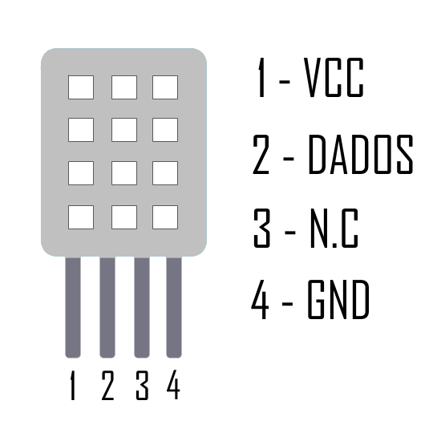

# Introdução a IOT com arduino e ESP8266

## Comunicação serial

A comunicação serial é uma das formas mais comuns de comunicar dois sistemas digitais. Ela consiste em enviar os dados um bit por vez através de um barramento.
Em sistemas embarcados, ao falar de comunicação serial destacamos alguns protocolos especiais:

- RS-232
- RS-422
- RS-485
- UART
- USB(caso especial do UART)

No arduino temos a implementação da comunicação Serial feita na classe [Serial](https://www.arduino.cc/reference/en/language/functions/communication/serial/), essa implementação utiliza dois pinos, Rx (recepção) e Tx(transmissão). 
Esses pinos são utilizados para a comunicação USB do arduino com o computador, por isso quando desejamos comunicar o arduino com outro dispositivo serial devemos utilizar o [SoftwareSerial](https://www.arduino.cc/en/Reference/SoftwareSerial) que transforma dois pinos digitais do arduino em um barramento de comunicação serial.

```arduino
SoftwareSerial nomeserial(Rx, Tx);
```


É importante destacar que existem outros diversos tipos de comunicação de sistemas embarcados, como: SPI, I2C, CAN, entre outros. O arduino possui bibliotecas para lidar com uma vasta quantidade desses protocolos.

## Sensor de temperatura DHT11/DHT22

Sensor de temperatura e umidade que permite fazer leituras na faixa de -40 até 80 graus celsius e umidade entre 0 e 100%. Seu datasheet pode ser encontrado [aqui](https://www.filipeflop.com/produto/sensor-de-umidade-e-temperatura-am2302-dht22/). 



Para fazer a leitura desse sensor, devemos instalar a biblioteca DHT disponibilizada pela Adafruit (na versão 1.2.3), fazer o import e incializar uma instância do DHT escolhendo o tipo (DHT11 ou DHT22) e o pino digital que será utilizado para comunicação.

``` arduino
#include <DHT.h>

#define DHTPIN 5
#define DHTTYPE DHT11

DHT dht(DHTPIN, DHTTYPE);
```

Depois, quando quisermos fazer leituras da umidade podemos usar `dht.readHumidity()` e da temperatura `dht.readTemperature()`.

Com essa compreensão sobre o sensor e a comunicação serial, podemos fazer nosso primeiro projeto: ler o DHT11 utilizando a serial. (Projeto DHTread.ino)


## O ESP8266 - ESP12

O esp8266(também conhecido como nodeMCU), é um microcontrolador com capacidade para WiFi de fábrica. Ele é fabricado pela Espressif e embora essa fabricante não seja tradicional, a família ESP ganhou espaço no mercado por seu baixo preço, tornado-a muito atrativa para aplicações de Internet das Coisas

O esp8266 é um microcontrolador programável por si só, ele pode ser programado utilizando a "linguagem" arduino, LUA, node.js, python, C, C++, RUST e muitas outras linguagens. Devido a sua arquitetura de 32 bits, frequência de 80MHz e 64KB de memória RAM, as pessoas se sentiram confortáveis em portar implementações de diversas linguagens para esse dispositivo.

Mas mais importante, o firmware padrão (que pode ser baixado [aqui](http://learn.acrobotic.com/tutorials/post/esp8266-getting-started#step-2-lnk)) permite receber comandos AT, esses comandos permitem que outros dispositivos controlem o ESP através de uma comunicação serial. O comando `AT+RST` por exemplo reseta o dispositivo.

Com essa compreensão, podemos fazer nosso segundo projeto: Bridge USB-arduino-ESP (serialbridge.ino). Nesse projeto o arduino faz um papel de ponte de comunicação entre o computador e o ESP.

Muita atenção na hora de conectar o Tx do arduino no Rx do ESP pois o arduino possui saida de 5V e o ESP suporta entradas de 3.3V. Para fazer essa interface, devemos usar um levelshifter ou um divisor resistivo.

## O Projeto

No projeto iremos enviar dados a um servidor (pasta webserver), esses dados serão de temperatura e umidade e serão enviados em formato JSON para o endpoint /arduino/ como no exemplo abaixo
```json
{
  temperatura: 23.43,
  umidade: 60
}
```

O servidor terá um script em PHP para intrepretar esses dados e salvar no banco de dados.


